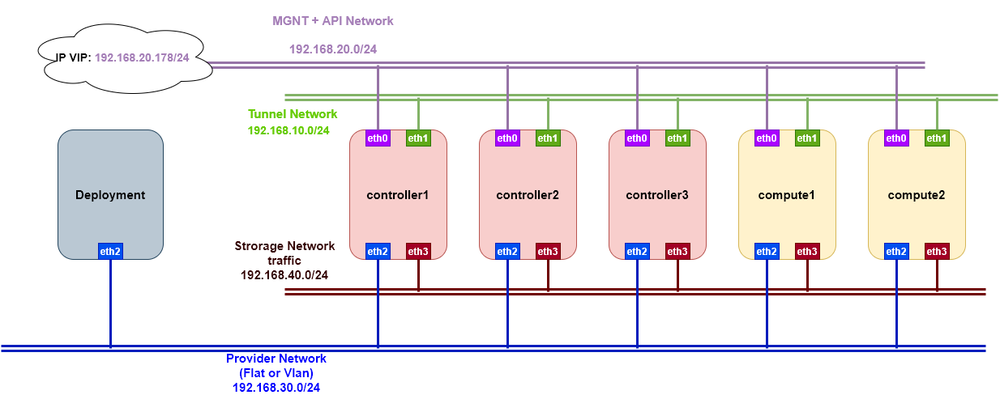
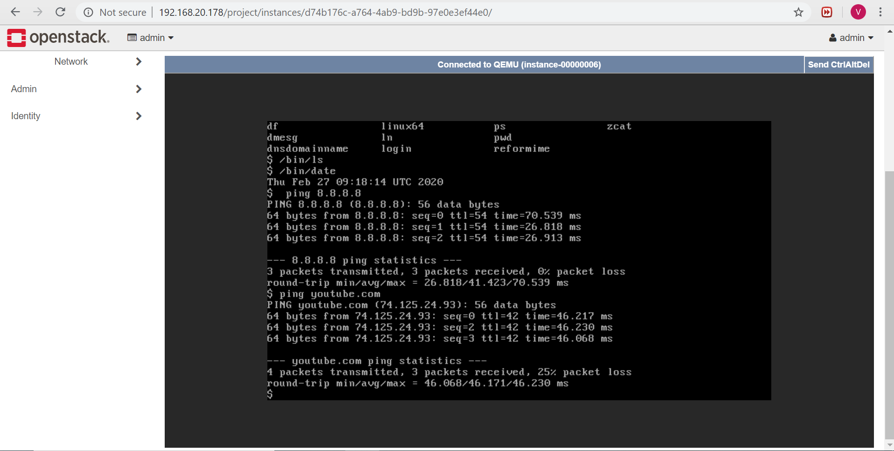

# Triển khai Openstack multinode HA bằng Kolla-ansible

# Mục lục
- [Mô hình triển khai](#1)
- [Cấu hình network, hostname](#2)
- [Thực hiện các phần mềm hỗ trợ trên các node](#3)
	- [Deployment](#4)
	- [Các node target](#5)
- [Thực hiện deploy bằng Kolla](#6)
- [ Thực hiện kiểm tra hệ thống sau cài đặt](#7)

<a name='1'></a>
## Mô hình triển khai
- Ở đây tôi sử dụng 4 card mạng cho mỗi node
	- eth0: Làm Management network quản lý giao tiếp API 
	- eth1: Làm đường cấp tunnel network cho VMs
	- eth2: Cung cấp IP public để các VMs sử dụng flat network đi ra internet
	- eth3: traffic dùng cho storage *( hiện tại chưa sử dụng)* 


- IP Plan


<a name='2'></a>
## Cấu hình network, hostname

- Node Deployment
```
hostnamectl set-hostname deployment


cat << EOF > /etc/sysconfig/network-scripts/ifcfg-eth1
TYPE=Ethernet
BOOTPROTO=static
NAME=eth1
DEVICE=eth1
ONBOOT=yes
IPADDR=192.168.30.198
NETMASK=255.255.255.0
GATEWAY=192.168.30.1
DNS1=8.8.8.8
EOF

cat << EOF > /etc/sysconfig/network-scripts/ifcfg-eth0
TYPE=Ethernet
BOOTPROTO=static
NAME=eth0
DEVICE=eth0
ONBOOT=yes
IPADDR=192.168.20.37
NETMASK=255.255.255.0
EOF
```
- Node Controller1

```
hostnamectl set-hostname controller1


cat << EOF > /etc/sysconfig/network-scripts/ifcfg-eth0
TYPE=Ethernet
BOOTPROTO=static
NAME=eth0
DEVICE=eth0
ONBOOT=yes
IPADDR=192.168.20.38
NETMASK=255.255.255.0
GATEWAY=192.168.20.1
DNS1=8.8.8.8
EOF

cat << EOF > /etc/sysconfig/network-scripts/ifcfg-eth1
TYPE=Ethernet
BOOTPROTO=static
NAME=eth1
DEVICE=eth1
ONBOOT=yes
IPADDR=192.168.10.26
NETMASK=255.255.255.0
EOF

cat << EOF > /etc/sysconfig/network-scripts/ifcfg-eth2
TYPE=Ethernet
BOOTPROTO=static
NAME=eth2
DEVICE=eth2
ONBOOT=yes
IPADDR=192.168.30.29
NETMASK=255.255.255.0
EOF

cat << EOF > /etc/sysconfig/network-scripts/ifcfg-eth3
TYPE=Ethernet
BOOTPROTO=static
NAME=eth3
DEVICE=eth3
ONBOOT=yes
IPADDR=192.168.40.32
NETMASK=255.255.255.0
EOF
```
- Node Controller2
```
hostnamectl set-hostname controller2


cat << EOF > /etc/sysconfig/network-scripts/ifcfg-eth0
TYPE=Ethernet
BOOTPROTO=static
NAME=eth0
DEVICE=eth0
ONBOOT=yes
IPADDR=192.168.20.35
NETMASK=255.255.255.0
GATEWAY=192.168.20.1
DNS1=8.8.8.8
EOF

cat << EOF > /etc/sysconfig/network-scripts/ifcfg-eth1
TYPE=Ethernet
BOOTPROTO=static
NAME=eth1
DEVICE=eth1
ONBOOT=yes
IPADDR=192.168.10.27
NETMASK=255.255.255.0
EOF

cat << EOF > /etc/sysconfig/network-scripts/ifcfg-eth2
TYPE=Ethernet
BOOTPROTO=static
NAME=eth2
DEVICE=eth2
ONBOOT=yes
IPADDR=192.168.30.38
NETMASK=255.255.255.0
EOF

cat << EOF > /etc/sysconfig/network-scripts/ifcfg-eth3
TYPE=Ethernet
BOOTPROTO=static
NAME=eth3
DEVICE=eth3
ONBOOT=yes
IPADDR=192.168.40.33
NETMASK=255.255.255.0
EOF
```
- Node Controller3
```
hostnamectl set-hostname controller3


cat << EOF > /etc/sysconfig/network-scripts/ifcfg-eth0
TYPE=Ethernet
BOOTPROTO=static
NAME=eth0
DEVICE=eth0
ONBOOT=yes
IPADDR=192.168.20.33
NETMASK=255.255.255.0
GATEWAY=192.168.20.1
DNS1=8.8.8.8
EOF

cat << EOF > /etc/sysconfig/network-scripts/ifcfg-eth1
TYPE=Ethernet
BOOTPROTO=static
NAME=eth1
DEVICE=eth1
ONBOOT=yes
IPADDR=192.168.10.37
NETMASK=255.255.255.0
EOF

cat << EOF > /etc/sysconfig/network-scripts/ifcfg-eth2
TYPE=Ethernet
BOOTPROTO=static
NAME=eth2
DEVICE=eth2
ONBOOT=yes
IPADDR=192.168.30.28
NETMASK=255.255.255.0
EOF

cat << EOF > /etc/sysconfig/network-scripts/ifcfg-eth3
TYPE=Ethernet
BOOTPROTO=static
NAME=eth3
DEVICE=eth3
ONBOOT=yes
IPADDR=192.168.40.31
NETMASK=255.255.255.0
EOF
```

- Node Compute1
```
hostnamectl set-hostname compute1


cat << EOF > /etc/sysconfig/network-scripts/ifcfg-eth0
TYPE=Ethernet
BOOTPROTO=static
NAME=eth0
DEVICE=eth0
ONBOOT=yes
IPADDR=192.168.20.40
NETMASK=255.255.255.0
GATEWAY=192.168.20.1
DNS1=8.8.8.8
EOF

cat << EOF > /etc/sysconfig/network-scripts/ifcfg-eth1
TYPE=Ethernet
BOOTPROTO=static
NAME=eth1
DEVICE=eth1
ONBOOT=yes
IPADDR=192.168.10.29
NETMASK=255.255.255.0
EOF

cat << EOF > /etc/sysconfig/network-scripts/ifcfg-eth2
TYPE=Ethernet
BOOTPROTO=static
NAME=eth2
DEVICE=eth2
ONBOOT=yes
IPADDR=192.168.30.33
NETMASK=255.255.255.0
EOF

cat << EOF > /etc/sysconfig/network-scripts/ifcfg-eth3
TYPE=Ethernet
BOOTPROTO=static
NAME=eth3
DEVICE=eth3
ONBOOT=yes
IPADDR=192.168.40.36
NETMASK=255.255.255.0
EOF
```

- Node Compute2
```
hostnamectl set-hostname compute2


cat << EOF > /etc/sysconfig/network-scripts/ifcfg-eth0
TYPE=Ethernet
BOOTPROTO=static
NAME=eth0
DEVICE=eth0
ONBOOT=yes
IPADDR=192.168.20.34
NETMASK=255.255.255.0
GATEWAY=192.168.20.1
DNS1=8.8.8.8
EOF

cat << EOF > /etc/sysconfig/network-scripts/ifcfg-eth1
TYPE=Ethernet
BOOTPROTO=static
NAME=eth1
DEVICE=eth1
ONBOOT=yes
IPADDR=192.168.10.36
NETMASK=255.255.255.0
EOF

cat << EOF > /etc/sysconfig/network-scripts/ifcfg-eth2
TYPE=Ethernet
BOOTPROTO=static
NAME=eth2
DEVICE=eth2
ONBOOT=yes
IPADDR=192.168.30.35
NETMASK=255.255.255.0
EOF

cat << EOF > /etc/sysconfig/network-scripts/ifcfg-eth3
TYPE=Ethernet
BOOTPROTO=static
NAME=eth3
DEVICE=eth3
ONBOOT=yes
IPADDR=192.168.40.35
NETMASK=255.255.255.0
EOF
```
<a name='3'></a>
## Thực hiện cài đặt các phần mềm hỗ trợ trên các node
<a name='4'></a>
### Deployment

*( Ở đây thực hiện cài đặt Kolla-ansible để điều khiển các node target)*

1. Cài đặt Kolla-ansible
- B1: Thực hiện update HĐH:
```
yum update -y
```
- B2: cài đặt các gói phụ thuộc
```sh
yum install -y epel-release
yum update -y
yum install python-devel libffi-devel gcc openssl-devel libselinux-python git wget byobu yum-utils python-setuptools vim -y
	```
- B3: cài đặt pip. Cập nhật bản pip mới nhất. Do kolla yêu cầu bản ansible từ 2.6 trở lên.
```sh
easy_install pip
pip install -U pip
pip install ansible==2.6.13
```
- B4: Thực hiện cài đặt kolla-ansible tương ứng với phiên bản mới nhất (Train) của OpenStack:
```sh
pip install kolla-ansible==9.0.1
```

*(Kết quả các gói - Kết quả các gói)
- Ansible: --version 2.6.13 
	- `pip show ansible`
- Kolla-Ansible: --version 9.0.1
	- `pip show kolla-ansible`
- Pip: --version 20.0.2


- B5: Thực hiện clone --branch stable/train trên git:
```sh 
git clone  https://github.com/openstack/kolla-ansible --branch stable/train
```
- B6: Tạo thư mục cấu hình cho Kolla-ansible
```sh
mkdir -p /etc/kolla
chown $USER:$USER /etc/kolla
cp -r /usr/share/kolla-ansible/etc_examples/kolla/* /etc/kolla
```
- B7: Thực hiện thay thế thư mục role mặc định bằng thư mục roles clone trên git về
```sh
rm -rf /usr/share/kolla-ansible/ansible/roles/
	
cp -av kolla-ansible/ansible/roles/ /usr/share/kolla-ansible/ansible/
```
	
- B8: Copy file multinode mặc định của Kolla ra ngoài để sử dụng
```sh
 cp /usr/share/kolla-ansible/ansible/inventory/multinode /root/
```
- B9: Thực hiện điều chỉnh cấu hình cho ansible bằng cách tạo file sau. Khi chạy ansible thì cấu hình này sẽ được load
```sh
cat << EOF > ~/ansible.cfg
[defaults]
retry_files_enabled=False
host_key_checking=False
deprecation_warnings=False
pipelining=True
forks=100
EOF
```
- B10: Thực hiện tạo password cho các thành phần của OpenStack
	- Các Password được lưu tại `/etc/kolla/passwords.yml`
```sh
kolla-genpwd
```
	
2. Build image và cài đặt cấu hình docker registry local
- B1: Vì chưa pull được image từ docker hub về nên thực hiện build images, quá trình này diễn ra khá lâu nên sử dụng `byobu` để tạo ra session khác tránh việc mất phiên kết nối trong quá trình build
```
byobu
```
- B2: Thực hiện build Image
```sh
git clone https://github.com/openstack/kolla.git
cd kolla/
git branch -r
git checkout stable/train
cd kolla/
pip install tox
tox -e genconfig
/root/kolla/.tox/genconfig/bin/kolla-build -b centos
```
*Các image được build bằng tox sẽ có tag là `9.0.2`. Nên trong file /etc/kolla/globals.yml tôi phải thiết lập biến `openstack_release` thành `9.0.2`. Hiện tại tôi chưa biết cách để pull trực tiếp image build có sẵn tên là kolla/centos-binary-*:9.0.2 cho các node khác pull về, vì khi khai báo docker_registry như trên thì các node sẽ tìm image có tên là `192.168.30.198:5000/kolla/centos-binary-*:9.0.2` nên trên node deployment này tôi thực hiện đổi tên và push image về local để các node khác có thể pull được image*
- B3: Cài đặt docker distribution
```sh
sudo yum -y update
sudo yum -y install docker-distribution
systemctl start docker-distribution
systemctl enable docker-distribution
```
- B4: Cấu hình trong file `/etc/docker/daemon.json`
```sh
cat << EOF > /etc/docker/daemon.json
{
"insecure-registries" : ["192.168.30.198:5000"]
}
EOF
```

- B5: Khởi động lại docker
```
systemctl restart docker
```
- B6: Việc đổi tên repo và push khá mất thời gian nên tôi thực hiện viết 1 đoạn script
	- Nội dung đoạn script:
	```sh
	#!/bin/bash
	# gán các dòng của cột thứ nhất có chữ đầu là kolla thành biến a
	for a in `docker images |egrep "^kolla" |awk '{print $1}'`
	do 
	# Thực hiện lệnh ví dụ: docker tag kolla/centos-binary-neutron-metadata-agent:9.0.2  192.168.30.198:5000/kolla/centos-binary-neutron-metadata-agent:9.0.2

	docker tag $a:9.0.2 192.168.30.198:5000/$a:9.0.2

	# Thực hiện push image có tag tới local-registry
	docker push  192.168.30.198:5000/$a:9.0.2
	# Xóa các image cũ
	docker image rm $a:9.0.2
	done 
		```
	- Khi thực hiện xong chạy lệnh `docker images` kiểm tra :
	```sh
	[root@localhost ~]# docker images
	REPOSITORY                                                                  TAG                 IMAGE ID            CREATED             SIZE
	192.168.30.198:5000/kolla/centos-binary-neutron-server-opendaylight         9.0.2               eda3dfdabd91        7 days ago          1.11GB
	192.168.30.198:5000/kolla/centos-binary-ironic-conductor                    9.0.2               be647def7f18        7 days ago          1.22GB
	192.168.30.198:5000/kolla/centos-binary-neutron-server-ovn                  9.0.2               52edf24651fc        7 days ago          1.11GB
	192.168.30.198:5000/kolla/centos-binary-tacker-server                       9.0.2               4698a2f2649e        7 days ago          1.1GB
	```
	
3. Thực hiện chỉnh sửa các thông số khai báo của Kolla
- B1: Thực hiện điền các thông số cho file inventory `vi /root/multinode` *(Tại đây sẽ khai báo các node target cho Ansible thực thi)*
```sh
vi /root/multinode


# These initial groups are the only groups required to be modified. The
# additional groups are for more control of the environment.
[control]
# These hostname must be resolvable from your deployment host
192.168.20.38
192.168.20.35
192.168.20.33
# The above can also be specified as follows:
#control[01:03]     ansible_user=kolla

# The network nodes are where your l3-agent and loadbalancers will run
# This can be the same as a host in the control group
[network]
192.168.20.38
192.168.20.35
192.168.20.33

[compute]
192.168.20.40
192.168.20.34

[monitoring]
192.168.20.38
192.168.20.35
192.168.20.33

# When compute nodes and control nodes use different interfaces,
# you need to comment out "api_interface" and other interfaces from the globals.yml
# and specify like below:
#compute01 neutron_external_interface=eth0 api_interface=em1 storage_interface=em1 tunnel_interface=em1

[storage]
192.168.20.40
192.168.20.34
[deployment]
localhost       ansible_connection=local

```
- B2: Khai báo các thông số cấu hình cụm openstack trong Kolla từ file `/etc/kolla/globals.yml`
```sh
[root@deployment ~]# egrep -v "^$|^#" /etc/kolla/globals.yml
---
# Cài đặt Openstack trên hệ điều hành
kolla_base_distro: "centos"
# Định dạng cài đặt
kolla_install_type: "binary"
# Phiên bản Openstack muốn cài đặt
openstack_release: "9.0.2"
# Khai báo IP VIP
kolla_internal_vip_address: "192.168.20.178"
# Khai báo kết nối registry
docker_registry: "192.168.30.198:5000"
docker_registry_insecure: "yes"
# Các khai báo về interface cho các nodes
api_interface: "eth0"
tunnel_interface: "eth1"
neutron_external_interface: "eth2"
# Các khai báo cài đặt các service
enable_heat: "no"
enable_mariabackup: "yes"
```	

<a name='5'></a>
### Các node target
1. Cài đặt các gói phụ trợ
```sh
yum install -y epel-release
yum update -y

yum install -y git wget gcc python-devel python-pip yum-utils byobu
```
2. Cài đặt và cấu hình docker trên các node target
- Cài đặt docker
```sh
yum-config-manager --add-repo https://download.docker.com/linux/centos/docker-ce.repo
yum install -y docker-ce
```
- Cấu hình docker
```sh
mkdir /etc/systemd/system/docker.service.d

tee /etc/systemd/system/docker.service.d/kolla.conf << 'EOF'
[Service]
MountFlags=shared
EOF
```
- Khởi động lại docker
```
systemctl daemon-reload
systemctl enable docker
systemctl restart docker
```
3. Cài đặt pip cùng phiên bản với node deploy để cài đặt docker SDK cho python
```
pip install --upgrade pip
````
- pip version : 20.0.2

	
<a name='6'></a>
## Thực hiện dùng Kolla-Ansible deploy Openstack	

*(Thực hiện trên node deployment)*
- B1: Thực hiện cài đặt môi trường
```
kolla-ansible -i multinode bootstrap-servers
```
- B2: Kiểm tra xem hệ thống có sẵn sàng để cài đặt không
```
kolla-ansible -i multinode prechecks
```
- B3: Pull Image đã build từ node `deployment`
```
kolla-ansible -i multinode pull
```
- B4: Tiến hành cài đặt hệ thống openstack
```
kolla-ansible -i multinode deploy
```
- B5: Sau khi cài đặt và không có lỗi. Thực hiện tạo file `/etc/kolla/admin-openrc.sh` để truy cập môi trường 
```
kolla-ansible -i multinode post-deploy
```
- B6: Thực hiện copy file `admin-openrc.sh` sang các node target
```
scp /etc/kolla/admin-openrc.sh root@192.168.20.38:/root/
...
```
<a name='7'></a>
## Thực hiện kiểm tra hệ thống sau khi cài đặt 
<a name='8'></a>
### Thực hiện các node targer ( ví dụ ở đây là controller1)
- B1: Cài đặt virtualen
```sh
pip install virtualenv
virtualenv venv
```
- B2: Kích hoạt virtualen (chuyển vào virtualen) để thực hiện cài đặt gói
```
. venv/bin/activate
```
- B3: Thực hiện cài đặt OpenStack client trong virtualen. Lúc ở trong virtualen sẽ có dòng sau ở đầu (venv)
```sh
pip install python-openstackclient
```
- B4: Thực hiện import biến môi trường 
```sh
source admin-openrc.sh
```
- B5: Thực hiện kiểm tra hoạt động
```sh
# Các lệnh kiểm tra
openstack token issue
openstack project list
```
- B6: Download và upload image `cirros`
```
wget http://download.cirros-cloud.net/0.3.4/cirros-0.3.4-x86_64-disk.img

openstack image create "cirros" \
--file cirros-0.3.4-x86_64-disk.img \
--disk-format qcow2 --container-format bare \
--public
```
- B7: Kiểm tra qua dashboard

	- Truy cập qua IP-VIP `192.168.20.178`
	
	- Tìm password để đăng nhập : 
	```sh
	[root@deployment ~]# egrep -i keystone_admin_password /etc/kolla/passwords.yml
	```
 Thực hiện tạo network(flat, private), router, VMs
 *(Trong file `/etc/kolla/neutron-openvswitch-agent/ml2_conf.ini` cấu hình được khai báo `flat_networks = physnet1` nên khi tạo network flat cần lưu ý)*



--- 
# Tham khảo
- https://github.com/TrongTan124/ghi-chep-kolla-ansible/blob/master/docs/01.Cai%20dat%20AIO.md

- https://gist.github.com/congto/a8459e3ca465a08d651f11600afabe7b

- https://opendev.org/openstack/kolla-ansible/src/branch/stable/train/doc/source/admin