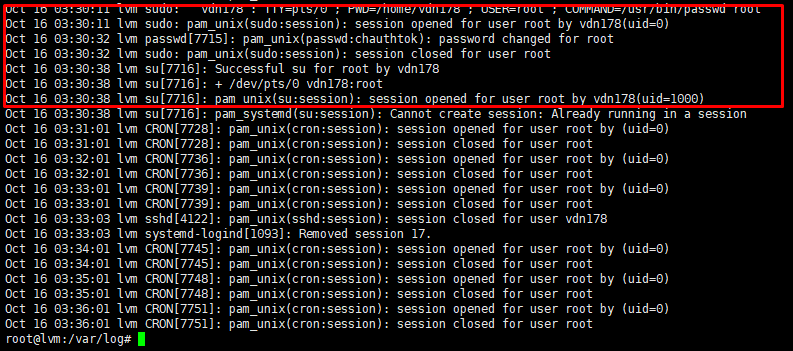

# Log, syslog, rsyslog
# Mục lục
* [1. Log để làm gì?](#1)
* [2. Khái niệm và nguyên lý hoạt động](#2)
    * [log]()
    * [syslog]()
    * [rsyslog]()
*  [3. Log tập trung](#3) 
* [3. Mô tả](#4)
* [Tham khảo](#tk)
---

## Log là gì, để làm gì?

* *VD*: Khi quản lý một server chưa nhiều dữ liệu quan trọng hoặc đã cài đặt rất nhiều ứng dụng , tính năng. Server hoạt động liên tục 24/24, nhưng tự dưng mất dữ liệu. Muốn điều tra xử lý hay tìm nguyên nhân khắc phục hậu quả xảy ra thì `Log` sẽ giúp việc này.

* *Tác dụng của log là:*
    * Log sẽ ghi lại liên tục các thông báo về hoạt động của cả hệ thống, các dịch vụ được triển khai trên hệ thống
    * Các file log sẽ cho bạn biết tất cả các tiến trình diễn ra trong hệ thống
    * Trong Linux thì /var/log là nơi lưu lại tất cả log

*Nếu file log lớn thì dùng câu lệnh tail -n để xem các dòng cuối*

## 2. Khái niệm và nguyên lý hoạt động

### Log

* *Syslog*: Log hệ thống thông thường chứa các thông tin mặc định của hệ thống, thường được lưu trong /var/log/syslog hoặc /var/log/message.

*ở đây nói đã thực hiện một cronjob mỗi phút một lần*

* *Authorization log* lưu các thông tin về các hệ thống ủy quyền, các cơ chế ủy quyền các user, nhắc nhở về user password, ví dụ như hệ thống PAM (Pluggable Authentication Module), sudo command, các đăng nhập tới sshd. Các thông tin này được lưu lại trong /var/log/auth.log File log cung cấp các thông tin về đăng nhập user, việc sử dụng sudo command.

*ở đây nói đã thay đổi mật khẩu của root, kết thúc phiên user để chuyển sang root*

*

**Nguồn sinh ra log**

|Facility Number|Nguồn tạo log | Ý nghĩa |
|---------|--------------|---------|
|0|kernel | Những log mà do kernel sinh ra |
|1|user | Log ghi lại cấp độ người dùng|
|2|mail | Log của hệ thống mail |
|3|daemon | Log của các tiến trình trên hệ thống |
|4|auth | Log từ quá trình đăng nhập hệ hoặc xác thực hệ thống |
|5|syslog | Log từ chương trình syslogd |
|6|lpr | Log từ quá trình in ấn |
|7|news | Thông tin từ hệ thống | 
|8|uucp | Log UUCP subsystem |
|9||Clock deamon|
|10|authpriv|Quá trình đăng nhập hoặc xác thực hệ thống|
|11|ftp|Log của FTP deamon|
|12||Log từ dịch vụ NTP của các subserver|
|13||Kiểm tra đăng nhập|
|14||Log cảnh báo hệ thống|
|15|cron|Log từ clock daemon|
|16 - 23|local 0 -local 7|Log dự trữ cho sử dụng nội bộ|

**Mức độ cảnh bảo**

|Code|Mức cảnh báo|	Ý nghĩa|
|---------|--------------|---------|
|0|emerg|	Thông báo tình trạng khẩn cấp|
|1|alert|	Hệ thống cần can thiệp ngay|
|2|crit|	Tình trạng nguy kịch|
|3|error|	Thông báo lỗi đối với hệ thống|
|4|warn|	Mức cảnh báo đối với hệ thống|
|5|notice|	Chú ý đối với hệ thống|
|6|info|	Thông tin của hệ thống|
|7|debug|	Quá trình kiểm tra hệ thống|

### Syslog 

    
 * Syslog là một giao thức client/server là giao thức dùng để chuyển log và thông điệp đến máy nhận log. Máy nhận log thường được gọi là syslogd, syslog daemon hoặc syslog server. 
    * Syslog có thể gửi qua UDP hoặc TCP. Các dữ liệu được gửi dạng cleartext. Syslog dùng cổng 514 cho UDP 
    * Rsyslog sử dụng port 10514 cho TCP, đảm bảo rằng không có gói tin nào bị mất trên đường đi.
    * Bạn có thể sử dụng giao thức TLS/SSL trên TCP để mã hóa các gói Syslog của bạn, đảm bảo rằng không có cuộc tấn công trung gian nào có thể được thực hiện để theo dõi log của bạn.
