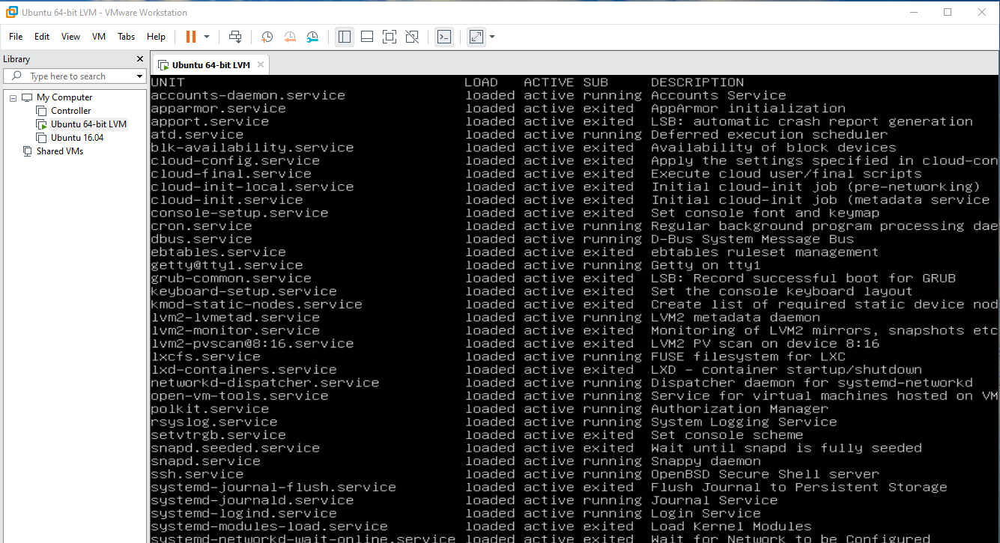

# Tìm hiểu về Systemd để quản lý service trong Linux

# Mục lục:
* [Khái niệm và minh họa](#1)
* [Tham khảo](#tk)


## Khái niệm


 *Systemd là gì?*

 * Systemd thuộc nhóm chương trình: system and service manager
 * Nó quản lý ( bật/tắt/khởi động lại...) các dịch vụ chạy trên máy từ lúc bật máy cho đến lúc tắt máy.
 * Nó cũng quản lý luôn cả hệ thống (system) cụ thể là các công việc:
    
    - set tên máy (hostname)
    - Cấu hình loopback interface
    - Thiết lập và mount các filesystem như /sys/proc,..
 * Systemd thường là process đầu tiên được chạy khi bật máy, còn được gọi là init system.


*Systemd cung cấp*:

* `systemctl`: dùng để quản lý trạng (start, enable, stop, status) của các dịch vụ hệ thống.
* `journald`: dùng để quản lý nhật ký hoạt động của hệ thống(ghi log)
* `logind`: dùng để quản lý và theo dõi việc đăng nhập/xuất của người dùng.
* `netword`: dùng để quản lý các kết nối mạng thông qua cấu hình mạng.
* `timedated`: dùng để quả lý thời gian hệ thống hoặc thời gian mạng
* `udev` : dùng để quản lý các thiết bị.
 
*unit service trong systemd*

* Loại này sẽ được khởi động khi bật máy
* Các `service` thường được cấu hình trong các file riêng biệt và được quản lý thôn qua `systemctl`
* Câu lệnh để xem các service :
 ```
    # systemctl list-units | grep -e '.service'
    hoặc
    # systemctl -t service
```


*Muốn thoát thì: ESC-->Space-->q*

* Các tùy chọn bật/tắt service trong systemctl :

    

    -  start : bật service
    - stop : tắt service
    - restart : khởi động lại service
    -  reload : load lại file cấu hình ( chỉ có 1 số service hỗ trợ như Apache / NginX ,... )
    - enable : service được khởi động cùng hệ thống
    - disable : service không được khởi động cùng hệ thống

*Ví dụ kiểm tra trạng thái dịch vụ ssh*:


---
# Tham khảo
[1] https://1hosting.com.vn/he-dieu-hanh-centos-7-co-gi-moi-va-khac-voi-centos-6-phan-2-systemd/


 [2] https://wiki.debian.org/systemd#Introduction

 [3]https://techtalk.vn/blog/posts/systemd-la-gi