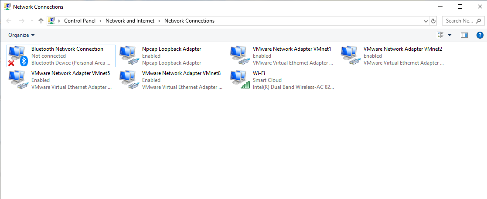
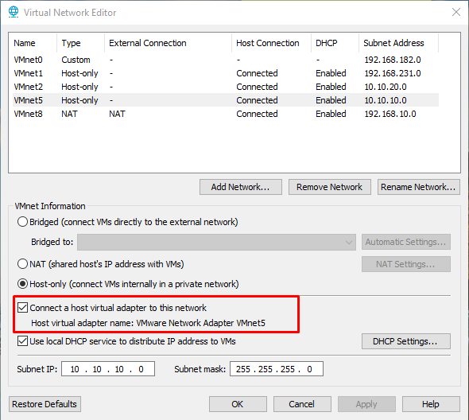
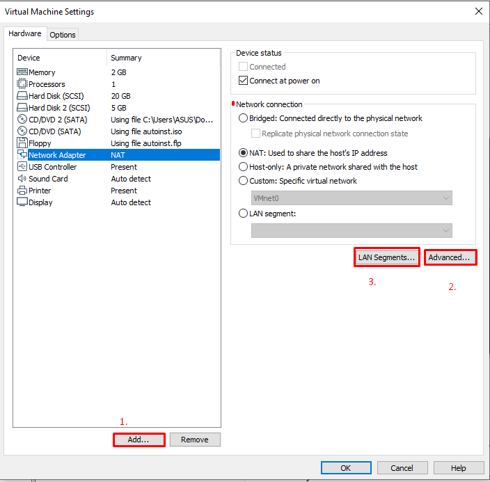
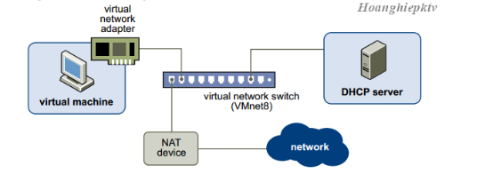
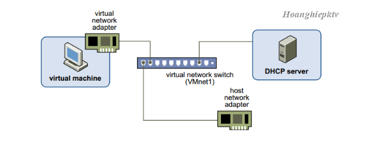

# Các card mạng trong VMware
 # Mục lục:

* [1. Thành phần trong mạng ](#1)
* [2. Mô tả](#2)
* [3. Chế độ trong switch ảo](#3)
* [Tham khảo](#tk)
---

## 1. Các thành phần trong mạng ảo trong Workstation bao gồm:

- Các bộ chuyển mạch ảo
    
    * Giống như switch vật lý, switch ảo sẽ kết nối các thành phần mạng với nhau.
    * Các thiết bị chuyển mạch ảo, còn được gọi là mạng ảo, được đặt tên là VMnet0, VMnet1, VMnet2,...
    * Một vài thiết bị chuyển mạch ảo được ánh xạ tới các mạng cụ thể theo mặc định
    * VMware Workstation (phiên bản 12) cho phép tạo 20 switch ảo trên Windows và 255 cái trên Linux. Trên mỗi Switch ảo trên Windows thì các kết nối của các máy tính ảo (host) vào mỗi Switch ảo là không giới hạn, còn trên Linux thì 32 máy ảo.

- Các Network adapters ảo

    * Từ VMware Workstation 6.0 trở về sau này máy ảo có thể hổ trợ đến 10 card, các phiên bản trước bị giới hạn ở 3 card mạng. Thêm bớt card mạng bạn nhấn vào nút Add… hoặc Remove… trong Virtual Machine Setting

- Máy chủ DHCP ảo
    
    * 
- Thiết bị NAT
    
    * 

## 2. Mô tả 

### Các bộ chuyển mạch ảo

*Giải thích*

* Vmnet0: Riêng VMnet0 kết nối trực tiếp với card mạng vật lý thông qua cơ chế bắt cầu (bridged) nên không tạo ra card VMnet

* Vmnet8: VMnet8 mặc định sẽ sử dụng cơ chế NAT
* Các Vmnet khác được thêm vào sẽ ở chế độ Host-Only

Kiểm tra xem card mạng ảo kết nối đã được bật chưa:

### Các Network adapters ảo

   
   * [1.] Tạo thêm card mạng   

  * [2.]Nếu copy máy ảo thì cũng thay đổi địa chỉ MAC

  * [3.] Lan Segment: Các card mạng của máy ảo có thể gắn kết với nhau thành từng LAN Segment. Không giống như VMnet, LAN Segment chỉ kết nối các máy ảo được gán trong một LAN Segment lại với nhau mà không có những tính năng như DHCP và LAN Segment không thể kết nối ra máy thật như các Virtual Switch VMnet.

## 3. Các chế độ khi kết nối với switch ảo:

 * Chế độ Bridge: ở chế độ này, card mạng trên máy ảo được gắn vào VMnet0, VMnet0 này liên kết trực tiếp với card mạng vật lý trên máy thật, máy ảo lúc này sẽ kết nối internet thông qua  card mạng vật lý và có chung lớp mạng với card mạng vật lý.

 

*Chế độ Bridge đơn giản là gắn trực tiếp vào switch vật lý của máy tính*

 * Chế độ NAT: ở chế độ này, card mạng của máy ảo kết nối với VMnet8, VNnet8 cho phép máy ảo đi ra mạng vật lý bên ngoài internet thông qua cơ chế NAT (NAT device). Lúc này lớp mạng bên trong máy ảo khác hoàn toàn với lớp mạng của card vật lý bên ngoài, hai mạng hoàn toàn tách biệt. IP của card mạng máy ảo sẽ được cấp bởi DHCP của VMnet8, trong trường hợp bạn muốn thiết lập IP tĩnh cho card mạng máy ảo bạn phải đảm bảo chung lớp mạng với VNnet8 thì máy ảo mới có thể đi internet.

 *Chế độ NAT dùng để chuyển dịch địa chỉ từ IP private thành IP public để đi ra mạng ngoài*

* Cơ chế Host-only:  máy ảo được kết nối với VMnet có tính năng Host-only, trong trường hợp này là VMnet1 . VNnet Host-only kết nối với  một card mạng ảo tương ứng ngoài máy thật (như đã nói ở phần trên). Ở chế độ này,  các máy ảo không có kết nối vào mạng vật lý bên ngoài hay internet thông qua máy thật , có nghĩa là mạng VMnet Host-only và mạng vật lý hoàn toàn tách biệt. IP của máy ảo được cấp bởi DHCP của VMnet tương ứng. Trong nhiều trường hợp đặc biệt cần cấu hình riêng, ta có thể tắt DHCP trên VMnet và cấu hình IP bằng tay cho máy ảo.

---

## Tham khảo:

[1] https://pubs.vmware.com/workstation-9/index.jsp?topic=%2Fcom.vmware.ws.using.doc%2FGUID-93BDF7F1-D2E4-42CE-80EA-4E305337D2FC.html

[2] https://www.engisv.info/?p=134

[3] https://sites.google.com/site/anhtt01/bai-viet/windows-server/vmnet
