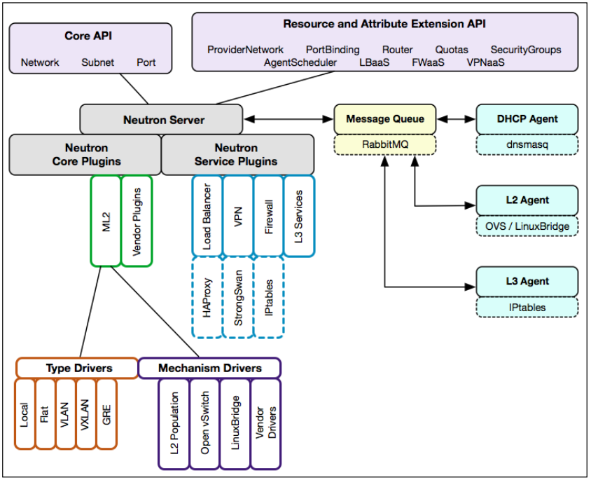

# Tìm hiểu về Project Neutron trong Openstack

## *Mục lục:*
- [1. Các thuật ngữ cơ bản ](#1)
    - [1.1 Router](#1.1)
    - [1.2 Firewalls](#1.2)
    - [1.3 Load balancers](#1.3)
    - [1.4 SNAT](#1.4)
    - [1.5 DNAT](#1.5)
    - [1.6 one to one NAT](#1.6)
    - [1.7 GRE](#1.7)
    - [1.8 VXLAN](#1.8)
- [2. Openstack Networking](#2)
    - [2.1 Khái niệm](#2.1)
        - 

## 2. Openstack networking

### 2.1 Khái niệm

- OpenStack Networking cho phép bạn tạo và quản lý network objects, như networks, subnets, và ports.
- Neutron quản trị network trong Openstack
- Cung cấp cho VM 1 đường kết nối: VM cần IP thì cấp cho IP (public và private)
- Chỉ tác động đến Vm và khối Nova Compute để lấy IP

- *Neutron Server*: Phụ trách về API quản lý database ,..(Core)
- *Neutron service plugins*: Router, Switch, VPN, Load balancer, Firewalls
- *Neutron core Plugin*
    - Vendor : Cisco, Jupiter,.. Neutron tích hợp với các thiết bị phần cứng đặc thù

    - ML2: Quản trị mô hình mạng ( 5 type Drivers)         
        - Flat : Dải Ip mà bạn cấp ( ví dụ cấp /24 thì chỉ cấp được 253 IP cho các Vm cho OPS)
        - VLAN: Bao nhiêu VLAN thì Khai báo bấy nhiêu VLAN vào Neutron
        - VXLAN và GRE: kỹ thuật tunnels triển khai overlay và underlay
        (Muốn triển khai mạng Private phải triển khai hệ thống overlay)
    - Mechanish Drivers:
        - Open vSwitch, Linux Bridge : sw ảo layer2

- RabbitMQ
- Neutron Agents
    - L2 Agent (OVS)
    - L3 Agent (Iptables)
    - DHCP Agent: Dùng dnsmasq để cấp phát IP

***Flow trong neutron*** 

***Các khái niệm trong neutron*** 

- provider network :
    - Provider network được tạo với thông tin quản trị, chỉ định cụ thể mạng là vật lý, phù hợp với mạng đã có trong data center. Chi tiết được mô tả trong một mạng provider: thuộc tính network_type, provider:physical_network, và provider:segmentation_id
    - Provider network có thể có cả flat và vlan

- Self-service :
    - Self-service networks chủ yếu cho phép các projects chung (không có đặc quyền) để quản lý mạng mà không cần đến admin. Các mạng này hoàn toàn là virtual và yêu câu virtual routers tương tác với provider và các mạng bên ngoài Internet. Self-service networks cũng thường cung cấp các DHCP và metadata services đến instances.
    - Trong hầu hết các trường hợp, self-service networks sử dụng overlay protocol như VXLAN và GRE bởi vì chugn có thể hỗ trợ nhiều mạng hơn layer-2 segementation bằng cách sử dụng VLAN tagging (802.1q).
    -   IPv4 self-service network sử dụng dải địa chỉ private IP và tương tác với provider network thông qua source NAT trên virtual routers. Địa chỉ Floating IP cho phép truy cập đến instance từ provider networks thông destionation NAT trên virtual router.

- Kết nối với nova
Neutron cần metadata 
1 vm khi muốn lấy thông tin metadata thì phải lấy Ip thì

- Security group do neutron quarn lý nhằm bảo mật cho Vm 
(giúp Vm hạn chế nhiều traffic không mong muốn)

- Port :
    - Port là điểm để kết nối để gắn 1 thiết bị, chẳng hạn NIC của virtual server, đến virtual network. Port cũng mô tả cấu hình mạng liên quan, chả hạn như MAC và địa chỉ IP được sử dụng trên port đó.

- Router:
    - Router cung cấp virtual layer-3 services như routing và NAT giữa self-service network và provider network hoặc giữa các self-service networks phụ thuộc vào project. Networking service sử dụng layer-3 agent để quản lý routers thông qua namespaces.