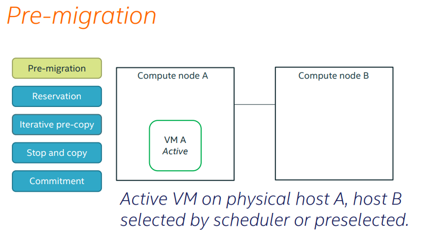
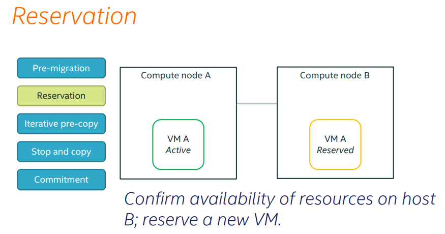
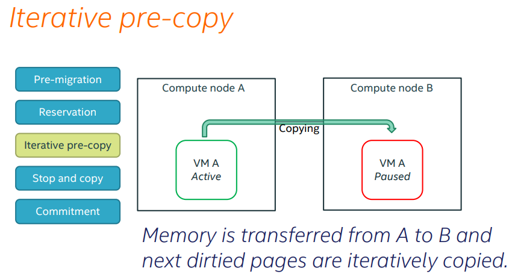
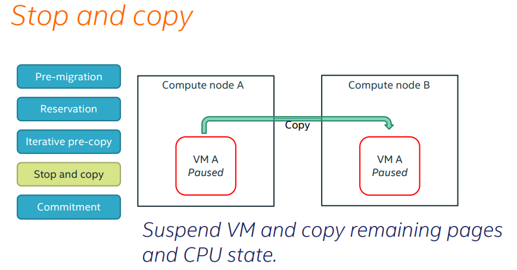
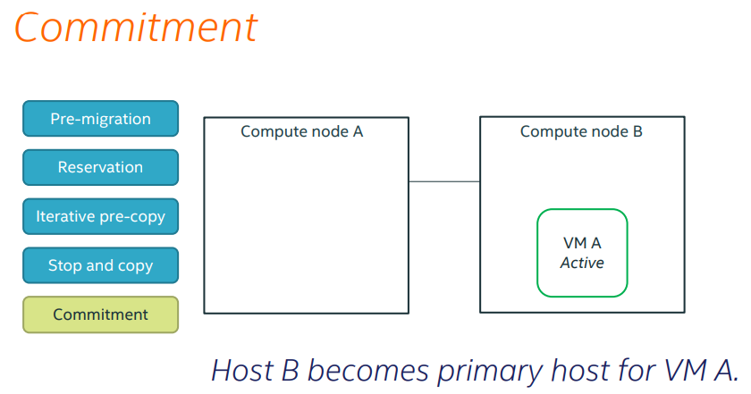

# Migrateion

## *Mục lục:*

- [1. Giới thiệu Migrate trong OPS](#1)
- [2. Các kiểu migrate trong OPS](#2)
    - [2.1 Live Migration](#2.1)
    - [2.2 Cold Migrate (Non-live migrate)](#2.2)
    - [2.3 So sánh](#2.3)

## 1. Giới thiệu về Migrate

- Migration là quá trình di chuyển VM từ Host vật lý này sang một host vật lý khác. Migraion được sinh ra để làm nhiệm vu duy trì và bảo dưỡng các node, nâng cấp hệ thống.
    - Cân bằng tải: Chuyển VMs đến các host khác khi phát hiện host (node) có dấu hiệu quá tải.
    - Bảo trì, nâng cấp hệ thống: Di chuyển các VMs ra khỏi Host trước khi tắt.
    - Khôi phục lại máy ảo khi host gặp lỗi

 ## 2. Các kiểu Migrate trong OPS

*Có 2 kiểu Migration trong Openstack là:*
- Live migration: 
    - True live migration (share storage or volume-based)
    - Block live migration
- Cold migration: Non-live migration

### 2.1 Live migration

- Có 2 loại live migration: normal migration và block migration.

- Live Migration workflow
    
    - Phía Compute node A Kiểm tra storage backend thích hợp với loại migration hay không:
        
        -  Thực hiện kiểm ta hệ thống shared storage cho normal migrations
        - Thực hiện kiểm tra các yêu cầu cho block migrations
        - Kiểm tra trên cả source và destination, điều phối thông qua RPC calls từ scheduler.

    

    - Phía compute node B (destination) 
        - Tạo các volume cần thiết sẵn sàng cho quá trình
        - Nếu là block migration, tạo thư mục instance, lưu lại các file bị mất từ glance và tạo instance disk trống.

    
    - Phía node compute A, Khởi tạo tiến trình Migration:
        - Bắt đầu thực hiện Copy VMs

    
    

    - Khi tiến trình hoàn tất, tái sinh file Libvirt XML và define nó trên destination. 

    

     - Xác thực xong!

    

### 2.3 Cold Migration
- Migrate khác live migrate ở chỗ nó thực hiện migration khi tắt máy ảo ( Libvirt domain không chạy)
- Yêu cầu SSH key pairs được triển khai cho user đang chạy nova-compute với mọi hypervisors.
- Migrate workflow:

    - Tắt máy ảo ( tương tự “virsh destroy” ) và disconnect các volume.
    - Di chuyển thư mục hiện hành của máy ảo ra ngoài ( (instance_dir -> instance_dir_resize). Tiến trình resize instance sẽ tạo ra thư mục tạm thời.
    - Nếu sử dụng QCOW2, convert image sang dạng RAW.
    - Với hệ thống shared storage, di chuyển thư mục instance_dir mới vào. Nếu không, copy thông qua SCP.

### 2.3 So sánh

- Cold migrate

    - Ưu điểm:
        - Đơn giản, dễ thực hiện
        - Thực hiện được với mọi loại máy ảo
    - Hạn chế:
        - Thời gian downtime lớn
        - Không thể chọn được host muốn migrate tới.
        - Quá trình migrate có thể mất một khoảng thời gian dài

- Live migrate

    - Ưu điểm:
        - Có thể chọn host muốn migrate
        - Tiết kiệm chi phí, tăng sự linh hoạt trong khâu quản lí và vận hành.
        - Giảm thời gian downtime và gia tăng thêm khả năng "cứu hộ" khi gặp sự cố
    - Nhược điểm:
        -Dù chọn được host nhưng vẫn có những giới hạn nhất định
        - Quá trình migrate có thể fails nếu host bạn chọn không có đủ tài nguyên.
        - Bạn không được can thiệp vào bất cứ tiến trình nào trong quá trình live migrate.
        - Khó migrate với những máy ảo có dung lượng bộ nhớ lớn và trường hợp hai host khác CPU

 
- Ngữ cảnh sử dụng:

    - Nếu bạn buộc phải chọn host và giảm tối da thời gian downtime của server thì bạn nên chọn live-migrate (tùy vào loại storage sử dụng mà chọn true hoặc block migration)
    - Nếu bạn không muốn chọn host hoặc đã kích hoạt configdrive (một dạng ổ lưu trữ metadata của máy ảo, thường được dùng để cung cấp cấu hình network khi không sử dụng DHCP) thì hãy lựa chọn cold migrate.